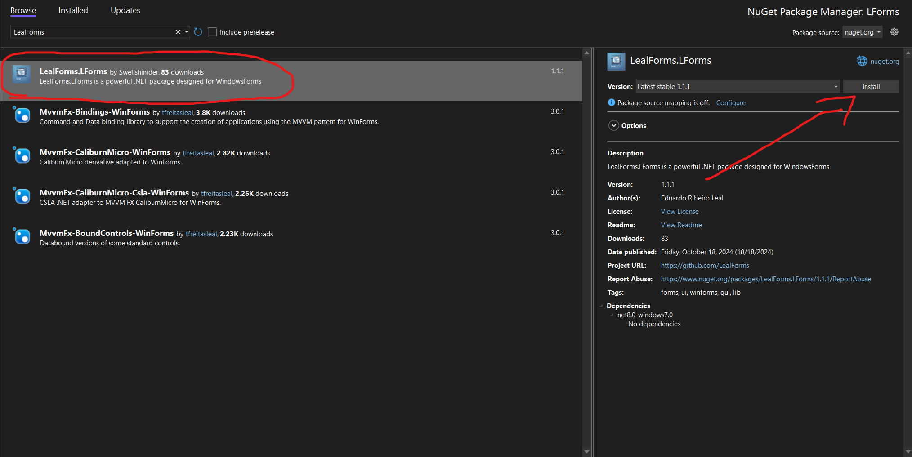
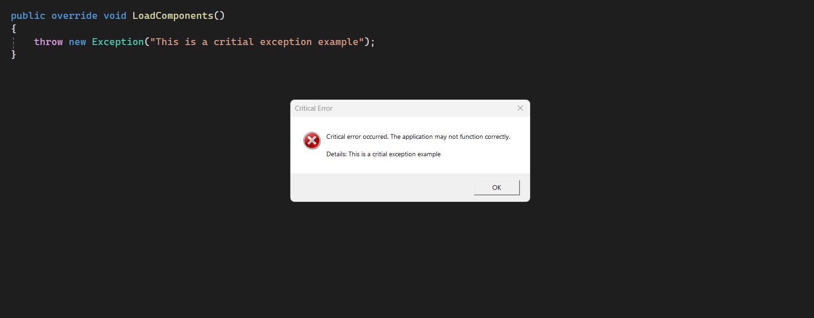

<div align="center">

# LealForms Library

[](https://www.nuget.org/packages/LealForms.LealForms/)

</div>

LealForms is a C# library designed to simplify the development of beautiful and functional applications using Windows Forms in .NET.

This library provides a set of customizable and user-friendly controls like buttons, panels, tabs, and a lot of extensions.

## Installation

You can install LealForms via terminal:

```bash
dotnet add package LealForms.LealForms --version 2.0.0
```

Or via nuget package manager in Visual Studio



## Basic Usage Example

#### Handling Critical errors

In your program entry point, consider using critial exception handler:

```csharp
using LForms.Enums;
using LForms.Extensions;
using System;
using System.Windows.Forms;

public static class Program
{
    [STAThread]
    public static void Main()
    {
        try
        {
            ApplicationConfiguration.Initialize();
            Application.Run(new MainForm());
        }
        catch (Exception ex)
        {
            // Handle critical exceptions to ensure the application exits gracefully,
            // showing an informative message box to the user.
            _ = ex.HandleException(ErrorType.Critical);
        }
    }
}
```

Result:



####  Using LealForm class

It's highly recommended to extend you forms using the `LealForm`, it has a bunch of usefull methods that you can use. 

It also automomatically set your form to darkmode, depending of your system theme.

```csharp
using LForms.Controls.Forms;

public class MainForm : LealForm
{
    public override void LoadComponents()
    {
        // You can load your controls in this method
        // This method is automatically called in base constructor
    }
}
```

Example:

```csharp
using LForms.Controls.Forms;

public class MainForm : LealForm
{
    public override void LoadComponents()
    {
        // Lets create the left panel, with a gradient to get some stylish
        var leftPanel = new LealGradientPanel()
        {
            Width = 200,
            Dock = DockStyle.Left,
            TopLeftGradientColor = Color.Blue,
            TopRightGradientColor = Color.Blue,
            BottomLeftGradientColor = Color.White,
            BottomRightGradientColor = Color.White,
        };
        this.Add(leftPanel); // Simplified method to add controls (no more 'object'.Controls.Add())

        // Lets add some selectable buttons without real functionality
        var button1 = new LealSelectableButton()
        {
            Text = "First button",
            AutoSearch = true, // This enables autoseach, means that if you click it will automatically search for others LealSelectableButtons to change their colors
            Selected = true, // Initialize button1 selected
            BorderSize = 0,
            MouseHoverColor = Color.Red,
            SelectedColor = Color.DarkRed,
            UnSelectedColor = Color.Transparent,
        };
        leftPanel.Add(button1);
        button1.HorizontalCentralize(); // Centralize horizontally the button to it parent
        
        var button2 = new LealSelectableButton()
        {
            Text = "Second button",
            AutoSearch = true,
            BorderSize = 0,
            MouseHoverColor = Color.Red,
            SelectedColor = Color.DarkRed,
            UnSelectedColor = Color.Transparent,
        };
        leftPanel.Add(button2);
        button2.HorizontalCentralize();

        var button3 = new LealSelectableButton()
        {
            Text = "Third button",
            AutoSearch = true,
            BorderSize = 0,
            MouseHoverColor = Color.Red,
            SelectedColor = Color.DarkRed,
            UnSelectedColor = Color.Transparent,
        };
        leftPanel.Add(button3);
        button2.HorizontalCentralize();

        // This creates and waterfall of all the LealSelectableButtons on Y axis, starting at 50, with 10 of padding between each one
        //
        // Button1
        // 
        // Button2
        //
        // Button 3
        leftPanel.WaterFallChildControlsOfTypeByY<LealSelectableButton>(50, 10);

        // Right panel creation
        var rightPanel = new LealPanel()
        {
            Dock = DockStyle.Fill,
        };
        this.Add(rightPanel);
        rightPanel.BringToFront();

        var messageButton = new LealButton()
        {
            Text = "Button Test",
            Rounded = true, // Gives the button rounded edges
        };
        messageButton.Click += (s, e) => ExecuteImportantThing();
        rightPanel.Add(messageButton);
        messageButton.Centralize(); // Centralize vertically and horizontally the button to it parent
    }

    private void ExecuteImportantThing()
    {
        try
        {
            throw new NotImplementedException();
        }
        catch (Exception e)
        {
            var dialogResult = this.HandleException(e, ErrorType.Process);

            if (dialogResult == DialogResult.Retry)
                ExecuteImportantThing();
        }
    }
}
```


## Documentation

For detailed documentation and examples, please visit the [Docs](./Docs/README.md). The repository includes:

- API Documentation: Comprehensive information about all classes and methods.
- Examples: Sample projects demonstrating how to use the library.
- Guides: Step-by-step tutorials to help you get started quickly.

## Documentation

Contributions are welcome! If you'd like to contribute to LealForms, please follow these steps:

1. Fork the Repository: Create a personal fork of the repository on GitHub.
2. Clone Your Fork: Clone your forked repository to your local machine.

```sh
git clone https://github.com/LealForms/LealForms.git
```

3. Create a Branch: Create a new branch for your feature or bug fix.

```sh
git checkout -b feature/branch-name
```

4. Make Changes: Implement your feature or fix the bug.
5. Commit Changes: Commit your changes with descriptive messages.

```sh
git commit -am "Add feature X to improve Y"
```

6. Push Changes: Push your changes to your forked repository.

```sh
git push origin feature/branch-name
```

7. Submit a Pull Request: Go to the original repository and submit a pull request.

## Issues

If you encounter any bugs or have feature requests, please open an issue on the Issues page.

## Author

Me: Eduardo Ribeiro Leal<br>
Email: <swellshinider@gmail.com><br>
Github: [Here!](https://github.com/Swellshinider)

## License

LealForms is licensed under the [MIT LICENSE](LICENSE)

## Thanks!

Thank you for using LealForms! I really hope this library helps your Windows Forms development.
