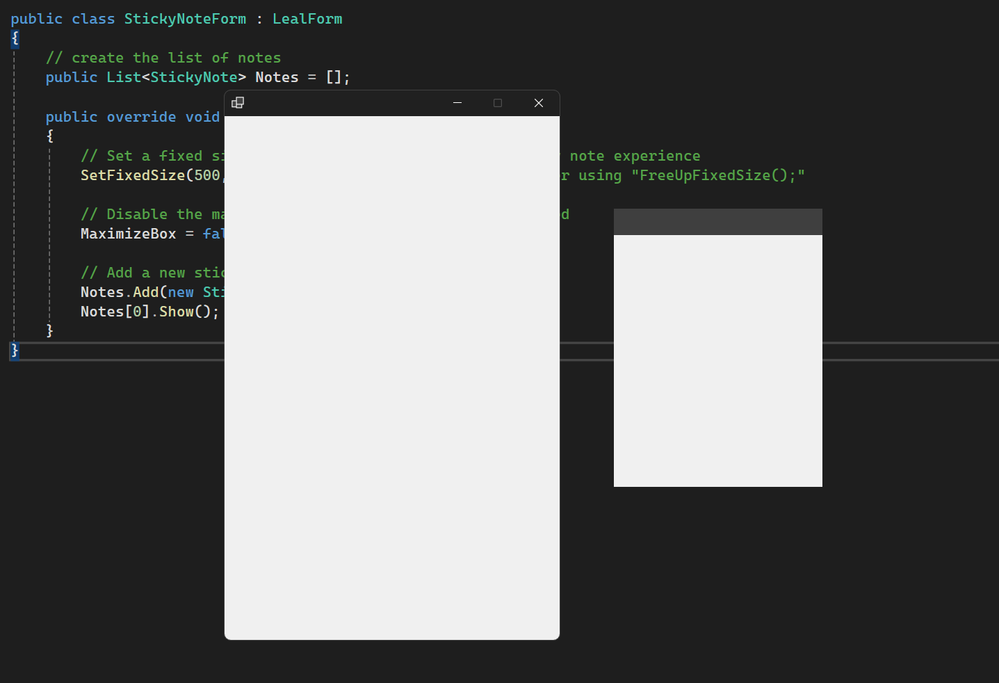

# LealForms Library

LealForms is a C# library designed to simplify the development of beautiful and functional applications using Windows Forms in .NET.
This library provides a set of customizable and user-friendly controls like buttons, panels, and tabs, allowing developers to create visually appealing user interfaces with ease.

## Installation

You can install LealForms via NuGet Package Manager:

```sh
Install-Package LealForms.LForms
```

## Getting Started

### Step 1: Create a New Windows Forms Project

Create a new Windows Forms project in Visual Studio. Once your project is ready, add the LealForms package.

### Step 2: Using LealForms Controls

Add the namespace to your code file:

```csharp
using LealForms.LForms;
```

You can now start using the provided controls in your forms. Here is an example of adding a customizable button:

```csharp
var myButton = new LealButton
{
    Text = "Click Me",
    Size = new Size(100, 40),
    Rounded = true, // Set to true to give the button rounded edges for a modern look
    Location = new Point(10, 10)
};
this.Add(myButton); // Adds the button to the form (simplified, no need for 'this.Controls.Add')
```

## Examples

### Sticky Note App

Below is a simple example to create a Sticky Note application using LealForms.

1. **Prepare the Main Entry Point with Error Handling**

In this example, we ensure that the application is launched safely by handling any unexpected errors in the `Main` method.

```csharp
public static class Program
{
    [STAThread]
    public static void Main()
    {
        try
        {
            ApplicationConfiguration.Initialize();
            Application.Run(new StickyNoteForm());
        }
        catch (Exception ex)
        {
            // Handle critical exceptions to ensure the application exits gracefully,
            // showing an informative message box to the user.
            _ = ex.HandleException(ErrorType.Critical);
        }
    }
}
```

2. **Create the StickyNoteForm Class**

The `StickyNoteForm` class inherits from `LealForm` and provides a convenient method for initializing the UI components.

```csharp
public class StickyNoteForm : LealForm // Inherit from LealForm to use its extended functionality
{
    public override void LoadComponents()
    {
        // Initialize all components that will be displayed in the application
        // This method acts as a custom constructor to set up your form's UI
    }
}
```

3. **Set Up the Sticky Note Form**

Let's start by configuring the form properties to create an appropriate user experience for a sticky note app.

- We will set the form to a fixed size since sticky notes typically have a consistent size, and there is no need for a resizable window.

```csharp
public override void LoadComponents()
{
    // Set a fixed size to the form for a consistent sticky note experience
    SetFixedSize(500, 800); // You can unlock the size later using "FreeUpFixedSize();"

    // Disable the maximize button as resizing is not necessary for a sticky note app.
    MaximizeBox = false; 

    // Additional UI components initialization can be added here
}
```

4. **Lets start to build our application**

- Lets create first create our custom sticky note class

```csharp
public class StickyNote : LealForm
{
    // Lets declare our components that will me used in that class
    public LealPanel? _topPanel;
    public LealTextBox? _textBox;

    public string Content { get; set; } = "";

    public override void LoadComponents()
    {
        // Remove the default border style for a cleaner look
        FormBorderStyle = FormBorderStyle.None;
        
        // Set the size of the sticky note
        Size = new Size(300, 400);
        
        // Ensure the form is always on top
        TopLevel = true;
        TopMost = true;
        
        // Configure the top panel with default settings
        _topPanel = new LealPanel()
        {
            Height = 38,
            Dock = DockStyle.Top,
            BackColor = Color.White.Darken(0.75), // darken the white color in 75%
        };
        this.Add(_topPanel);
        
        // Enable dragging the window by clicking on the top panel
        _topPanel.MouseDown += TopPanel_MouseDown;
    }

    private void TopPanel_MouseDown(object? sender, MouseEventArgs e)
    {
        // Allow the user to drag the form by holding down the mouse button on the top panel
        Handle.DragWindowOnMouseDown(e);
    }
}
```


- In our StickyNoteForm, we can already call our first sticky note

```csharp
public class StickyNoteForm : LealForm
{
    // Create a list to store sticky notes
    public List<StickyNote> Notes = [];

    public override void LoadComponents()
    {
        // Set a fixed size to the form for a consistent sticky note experience
        SetFixedSize(500, 800); // You can unlock the size later using "FreeUpFixedSize();"

        // Disable the maximize button as the form size is fixed
        MaximizeBox = false;

        // Create a new sticky note and add it to the list
        var newNote = new StickyNote();
        Notes.Add(newNote);

        // Display the first sticky note on the screen
        Notes[0].Show();
    }
}
```

- Executing our code, we have this:



- Really interesting for now right? Lets continue